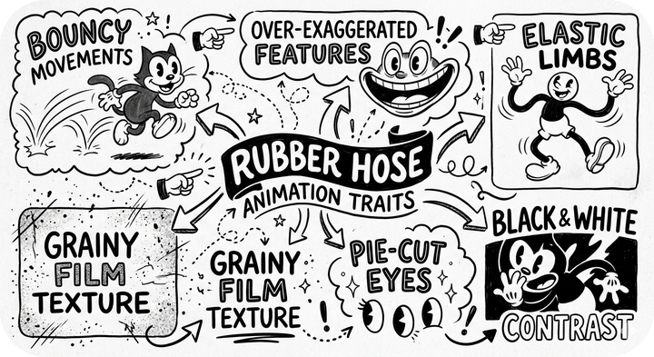
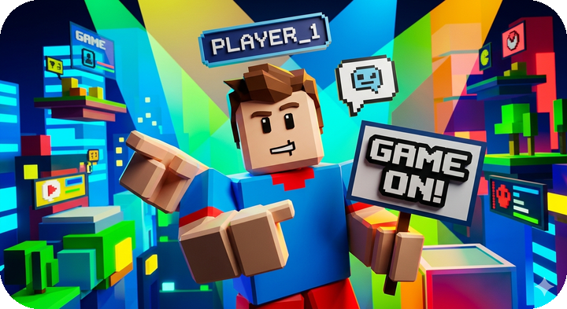
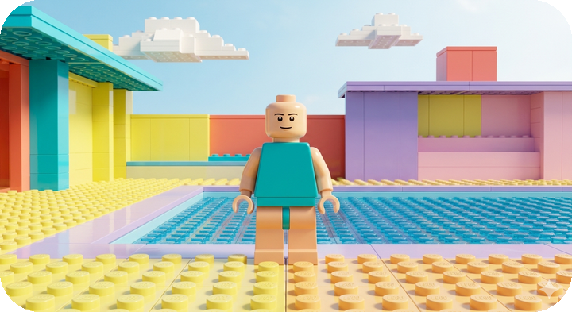

# Short & Sweet Style Prompts<!-- omit from toc -->

Add these to an image generation request or similar,
to influence the visual appearance.

> ℹ️ **Example Creation**   The examples are created using `show-case the style and its unique traits`, plus the style prompt.

**Index**
- [Sketch Note Style (Hand-drawn)](#sketch-note-style-hand-drawn)
- ["Notion-style" (Handcrafted 2D)](#notion-style-handcrafted-2d)
- ["Roblox-style" (Low-poly 3D Game World)](#roblox-style-low-poly-3d-game-world)
- [Lego Brick Style](#lego-brick-style)

## Sketch Note Style (Hand-drawn)
Use a dynamic sketch note style:

  - Hand-drawn icons, connective arrows, and varied typography for visual emphasis.
  - Organize key concepts into distinct spatial clusters wrapped in doodle-style borders and banners to create a clear, non-linear hierarchy of ideas.
  - Maintain an informal, high-energy, and organic aesthetic that prioritizes the "handcrafted" flow of a visual journal over standard, rigid text blocks.
  - Ensure the final output feels like a cohesive mental map that uses artistic flair to bridge the gap between complex data and instant clarity.

>  
> *Gemini 3 Flash (Nano Banana 2) with "Old cartoon."*

## "Notion-style" (Handcrafted 2D)
Flat 2D vector, Notion style line art, hand-drawn ink strokes, minimalistic style, lo-fi aesthetic. Keep it airy, use enough white space, but also balance it with the provided level of detail.

>  
> *Gemini 3 Flash (Nano Banana 2) with "Enamel pin."*

## "Roblox-style" (Low-poly 3D Game World)
Roblox-style low-poly 3D world, blocky cartoon avatars mid-action, vibrant high-contrast palette (bright blues, greens, yellows, reds). Chunky bold gaming typography, pixelated UI elements, neon-lit in-game environments (cityscapes, floating platforms, lobbies). Characters with floating name tags and speech bubbles; expressive poses — pointing, gesturing, holding signs. Take extra care that the floating name tags always match the character and are used consistently.

>  
> *Gemini 3 Flash (Nano Banana 2) with "Technicolor." The "Cyborg" visual style also pairs very well.*

## Lego Brick Style
Iconic plastic, modular 3D look:

  - **Use** a "Lego-only" construction logic where every single environmental element, from the clouds to the terrain, is composed of discrete, interlocking plastic bricks.
  - **Make sure you** incorporate visible top-side studs and distinct seams between pieces to emphasize the physical, modular assembly of the scene.
  - **Use** high-gloss ABS plastic shaders with bright, primary-heavy color schemes to mimic the exact look and "snap" of official retail sets.
  - **Make sure you** transform all living beings into classic minifigures with cylindrical heads, U-shaped hands, and painted-on facial expressions.
  - **Use** a macro lens perspective with soft, studio-quality lighting to highlight the small-scale texture and reflections of a physical tabletop model.

>  
> *Gemini 3 Flash (Nano Banana 2) with "Color block."*
